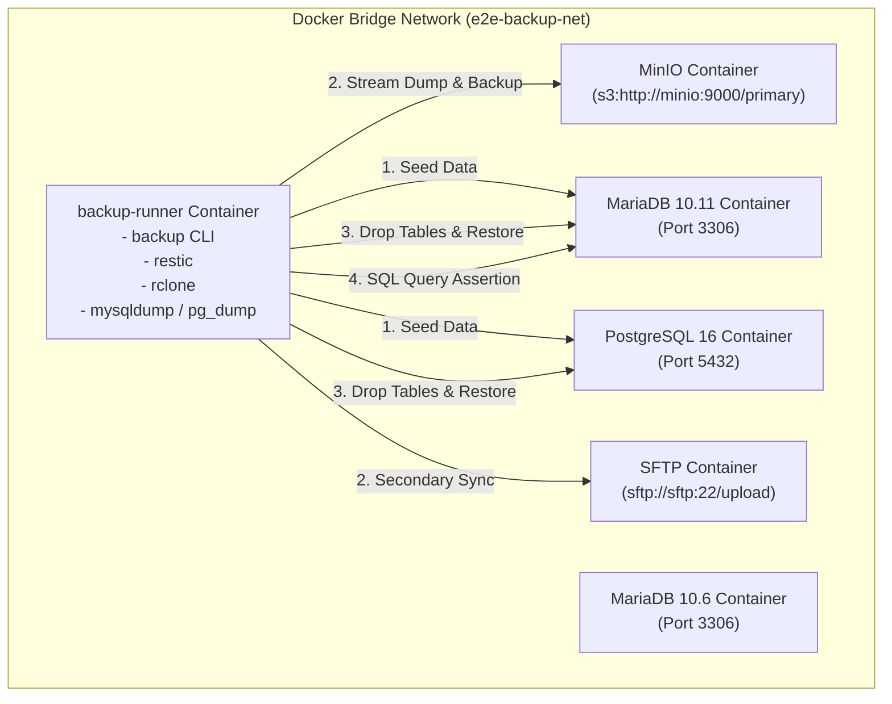

# Docker 컨테이너 완전 고립 E2E 매트릭스 테스트 설계서

- **작성일자**: 2026-07-23
- **목적**: `backup` 바이너리 및 `restic`, `rclone`, DB 클라이언트를 포함한 독립 Docker 컨테이너 이미지(`backup-runner`)를 빌드하고, Docker 네트워크 상에서 MinIO(S3), SFTP, MariaDB(10.11 / 10.6), PostgreSQL(16) 컨테이너 간의 실체 백업, 1차/2차 복사, DB 덤프 스트리밍, 테이블 drop 후 원복 및 SQL/SHA256 100% 동일성 검증을 완결성 있게 수행합니다.

---

## 1. 전용 Docker 이미지 및 네트워크 구조

---

## 2. 세부 검증 파이프라인 (Verification Pipeline)

1. **`backup-runner` 이미지 빌드**: `cargo build`로 컴파일된 `backup` 바이너리 + `restic` + `rclone` + `mariadb-client` + `postgresql-client` 조합 Alpine 기반 이미지 빌드.
2. **테스트 데이터 시딩 (Seeding)**: MariaDB 및 PostgreSQL 컨테이너에 `users` 및 `audit_logs` 테이블 생성 및 무결성 데이터 레코드 삽입.
3. **실제 백업 전송 (`backup run`)**: S3(Primary) 및 SFTP(Secondary) 저장소로 DB 스트리밍 덤프 및 파일 백업 전송.
4. **저장소 스냅샷 검증**: `restic snapshots` 명령으로 S3 및 SFTP 저장소 내 스냅샷 유효성 확인.
5. **재난 상황 모사 (Drop Tables)**: MariaDB/PostgreSQL의 테이블 삭제.
6. **복구 실행 (`backup restore`)**: S3/SFTP 저장소 스냅샷으로부터 DB 덤프 수신 후 원복.
7. **SQL & SHA256 검증**:
   - `SELECT name FROM users WHERE id=101;` ➡️ `BackupE2EUser` 검증
   - `SELECT log FROM audit_logs WHERE id=201;` ➡️ `PostgresAuditPayload` 검증
   - 원본 파일 SHA256 vs 복원 파일 SHA256 일치 검증
