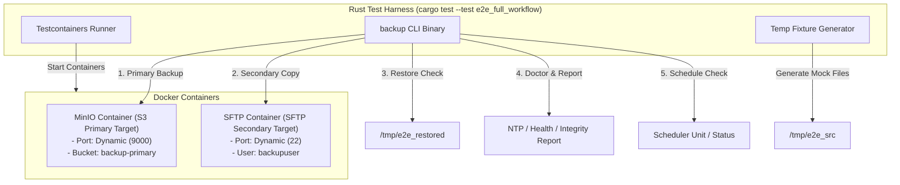

# Testcontainers 기반 E2E 통합 테스트 설계서 (Design Spec)

- **작성일자**: 2026-07-23
- **상태**: 승인됨 (Approved)
- **대상 파일**: `tests/e2e_full_workflow.rs` (신규 E2E 통합 테스트 모듈)

---

## 1. 개요 (Overview)

본 설계서는 `testcontainers-rs` 기반의 완전한 Docker 통합 테스트(End-to-End Integration Test) 체계를 구축하는 것을 목표로 합니다. 
단순 CLI 옵션 검증이나 단용 모의(Mock) 수준을 넘어, 실제 Docker 컨테이너(MinIO S3, atmoz/SFTP) 환경 상에서 백업 실행, 1차/2차 백업 데이터 카피, 데이터 원본 복구 검증, 무결성/NTP 진단 보고서, 스케줄러 관리까지의 전 과정을 자동 검증합니다.

---

## 2. 테스트 아키텍처 및 구성 요소 (Architecture & Components)

### 주요 구성 요소:
1. **MinioContainerHarness**: `minio/minio` 이미지 기반 S3 호환 Primary 저장소 컨테이너 (액세스 키 / 시크릿 키 / 버킷 설정).
2. **SftpContainerHarness**: `atmoz/sftp` 이미지 기반 SFTP Secondary 저장소 컨테이너 (사용자/비밀번호/업로드 경로 설정).
3. **Fixture Generator**: SHA256 검증용 테스트 데이터 파일(텍스트, 바이너리, 하위 디렉터리 구조)을 임시 디렉터리에 생성.
4. **CLI Exec Harness**: `assert_cmd::Command`를 사용하여 빌드된 `backup` 컴파일 바이너리를 호출.

---

## 3. 세부 테스트 파이프라인 시나리오 (Pipeline Steps)

| 단계 | 테스트 동작 | 검증 항목 (Assertions) |
|---|---|---|
| **Step 1. 컨테이너 및 환경 준비** | MinIO & SFTP 컨테이너 구동, 버킷 생성, 임시 소스 파일 및 설정 작성 | 컨테이너 포트 바인딩 확인, 소스 파일 SHA256 체크섬 기록 |
| **Step 2. 1차 백업 (Primary Backup)** | `backup run` 실행 (Primary Target: S3 MinIO) | Exit Code 0, S3 저장소 내 신규 restic/rclone 스냅샷 생성 확인 |
| **Step 3. 2차 백업 카피 (Secondary Copy)** | `backup run` 또는 복사 명령 실행 (Secondary Target: SFTP) | Exit Code 0, SFTP 저장소 상에 동일 스냅샷/데이터 동기화 완료 확인 |
| **Step 4. 복구 검증 (Restore Verification)** | 1차(S3) 및 2차(SFTP) 저장소 각각에서 파일 복구 수행 | 복구된 파일의 SHA256 체크섬이 원본 소스 파일과 100% 일치함을 확인 |
| **Step 5. 무결성 & NTP 진단 (Doctor & Report)** | `backup doctor` 실행 | 저장소 체크(`check`), NTP 동기화 진단 항목, 헬스체크 보고서 텍스트 생성 검증 |
| **Step 6. 스케줄러 검증 (Schedule)** | `backup schedule status / enable / disable` 실행 | 스케줄러 서브커맨드의 출력 및 상태 전환 성공 검증 |

---

## 4. 에러 처리 및 자원 해제 (Cleanup & Safety)

- **자원 해제 (RAII)**: `testcontainers` 식별자 객체가 Drop될 때 Docker 컨테이너가 자동으로 중지 및 삭제되도록 보장합니다.
- **임시 파일 정리**: `tempfile::TempDir`를 활용하여 테스트 종료 시 생성된 임시 파일 및 설정 디렉터리가 자동으로 제거되도록 처리합니다.

---

## 5. 검수 기준 (Success Criteria)

- `cargo test --test e2e_full_workflow` 실행 시 성공(Pass)해야 함.
- S3 / SFTP 연동 백업 및 1차/2차 카피, 복구 파일의 무결성(SHA256)이 엄격하게 검증되어야 함.
